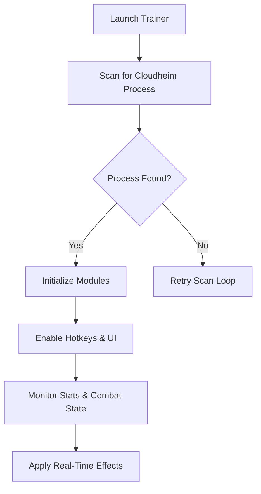

## Overview

The **Cloudheim Trainer** is a streamlined **single-player enhancement tool** focused on resource boosts, combat stability, pacing adjustments, and travel improvements.
Built on a stable modular engine, it offers real-time toggles and lightweight automation without altering core game files.

Compared to the Mod Menu, the Trainer is simpler, faster to use, and focused on direct utility—an excellent companion for story runs, build testing, or relaxed exploration.

[!IMPORTANT]
All trainer features are **offline-only** and not compatible with multiplayer or shared environments.

---

## Features

### ⚔️ Combat Stability Tools

Control battles with precise modifiers:

* infinite health
* infinite mana/stamina
* no cooldowns
* instant ability recharge
* damage multiplier slider
* enemy damage reduction

Perfect for players who want smoother combat or a more accessible experience.

---

### 💎 Resource & Inventory Enhancements

Accelerate progression across the sky islands:

* add gold / crystals / arcane materials
* resource multipliers (2× – 20×)
* rare-drop booster
* storage bypass
* fast-craft mode

Whether you’re upgrading gear or unlocking arcane research, resources flow freely.

---

### 🌤 Exploration & Mobility Support

Move through Cloudheim’s floating landscapes with ease:

* speed multiplier
* glide stamina freeze
* no fall damage
* teleport-to-marker
* mount boost mode

Traversal becomes smoother, safer, and more dramatic.

---

### 🛠 Crafting & Settlement Utilities

For players managing camps, workstations, or sky outposts:

* instant crafting
* instant upgrades
* worker stamina freeze
* crafting cost removal

---

### 👁 Awareness & Visual Tools

See your world with clarity:

* resource highlight
* interactable glow
* FPS & performance metrics
* simplified HUD mode

---

### 🧩 Profile System

Switch between curated setups:

* story explorer
* combat-mastery mode
* relaxed builder
* extreme farming mode

Each profile saves your active toggles and multipliers.

---

## Compatibility

| Platform       | Support | Notes                            |
| -------------- | ------- | -------------------------------- |
| Windows 10/11  | ✔️      | Full compatibility               |
| Steam Release  | ✔️      | Auto-detected                    |
| Epic Release   | ✔️      | Manual directory selection       |
| Linux (Proton) | ⚠️      | Some visual modules may not load |
| Consoles       | ❌       | Not supported                    |

*Accessibility:* Optional high-contrast mode, text scaling, and bind-only control.

---

## Setup ⚡

1. **Download the Cloudheim Trainer**
   Extract to a clean folder.

2. **Launch the Trainer**
   It automatically scans for the Cloudheim process.

3. **Start the Game**
   Load into your save or begin a new journey.

4. **Use Hotkeys or the Overlay**
   Toggle features instantly with no reload required.

5. **Fine-Tune the Pacing**
   Adjust values to craft the perfect Cloudheim experience.

### Sample Hotkeys

```plaintext
F1 — Infinite Health  
F2 — Infinite Mana  
F3 — No Cooldowns  
F4 — Add Gold  
F5 — Speed Multiplier  
F6 — Highlight Resources  
F7 — No Fall Damage
```

---

## Shields.io Badges


---

## Mermaid Diagram — Trainer Workflow



---

## Advanced Capabilities

### 🔬 Dynamic Value Hooks

Stable real-time manipulation during:

* spell-heavy combat
* multi-layer boss encounters
* fast-travel transitions

### 🎚 Scaling Modifiers

```json
{
  "gold_multiplier": 3,
  "xp_multiplier": 2,
  "drop_rate_bonus": 1.5,
  "speed_multiplier": 2.0
}
```

### 🤖 Soft Automation

Optional scripts include:

* auto-loot
* auto-cast buff abilities
* auto-collect resources

### 🔐 SaveGuard

For persistent edits, the Trainer creates automatic backups.

[!NOTE]
Runtime toggles never modify save data.

---

## Example Trainer Profile

```json
{
  "profile": "cloudbound_story",
  "infinite_hp": true,
  "infinite_mana": true,
  "speed_multiplier": 1.8,
  "visuals": {
    "highlight_resources": true
  },
  "combat": {
    "damage_multiplier": 2.5
  }
}
```

---

## FAQ

### **Does the Trainer disable achievements?**

No—runtime changes do not affect achievements.

### **Can this be used online?**

No, the Trainer is built strictly for offline single-player.

### **Why isn’t a feature working?**

Your game version may require updated offsets—use the built-in updater.

### **Can I remap all hotkeys?**

Yes—every hotkey is fully customizable.

### **Does the Trainer overwrite saves?**

Not unless you choose persistent editing (which always creates backups).

---

## Final Thoughts

Cloudheim is a soaring tapestry of magic, ruins, storms, and floating dreams.
The Trainer doesn’t overpower that world—it supports your journey through it, offering safety, speed, and flexibility when you want to focus on story, exploration, or experimentation.

It becomes a quiet wind beneath your wings—steady, soft, and always ready.
